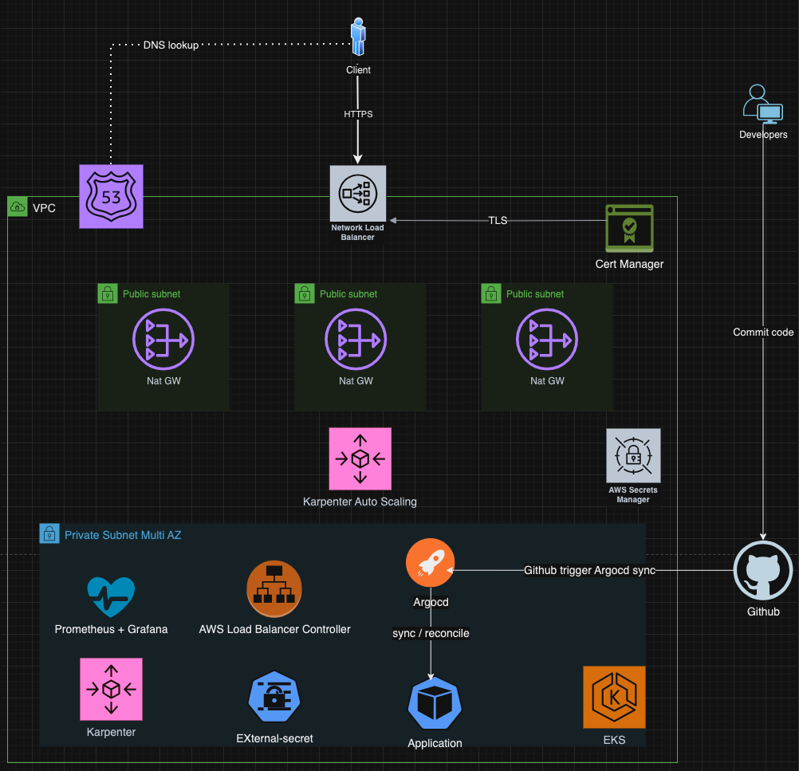

# argocd-service

## System diagram


## Resources deployed by Argocd:
- Nginx-controller
- External-dns
- Prometheus + Grafana (observability)
- reloader
- services:
  - frontend
  - canary-frontend
  - backend
  
## Resources have not deployed by Argocd:
- loki
- Prometheus + Grafana (observability)

## Ingresses deployed by Argocd ( currently can not access because eks worker nodes are terminated for saving money)
- [grafana](https://grafana.chuong.click/)
- [argocd](https://argocd.chuong.click/)
- [frontend](https://frontend.chuong.click/) 

## Repo structrue
```
├── README.md
├── bootstrap                   <-- bootstrap Argocd CRDs: project, application
│   |-cluster-dev.yaml
├── chart                       <-- helm chart of all microservices
│   └── service
│       ├── Chart.yaml
│       ├── templates
│       │   ├── _helpers.tpl
│       │   ├── configmap.yaml
│       │   ├── cronjob.yaml
│       │   ├── deployment.yaml
│       │   ├── externalsecret.yaml
│       │   ├── hpa.yaml
│       │   ├── ingress.yaml
│       │   ├── job.yaml
│       │   ├── service.yaml
│       │   └── serviceaccount.yaml
│       └── values.yaml
├── cluster                      <-- list of EKS cluster
│   └── cluster-dev              <-- EKS cluster dev
│       ├── platform             <-- Argocd Application for deploying platform tool in EKS dev
│       │   ├── Chart.yaml
│       │   ├── templates
│       │   │   ├── argocd.yaml
│       │   │   ├── external-dns.yaml
│       │   │   ├── ingress-nginx.yaml
│       │   │   ├── karpenter
│       │   │   ├── loki.yaml
│       │   │   ├── metrics-server.yaml
│       │   │   ├── observability.yaml
│       │   │   └── reloader.yaml
│       │   └── values.yaml
│       └── service              <-- Argocd Application for deploying microservices in EKS dev
│           ├── Chart.yaml
│           ├── templates
│           │   └── service.yaml
│           └── values.yaml
├── image
│   └── 1.png
└── value
    └── cluster-dev
        ├── platform             <-- platform tool helm chart folders
        └── service              <-- microservices helm chart folders
            ├── backend
            │   ├── Chart.yaml
            │   └── values.yaml
            ├── canary-frontend
            │   ├── Chart.yaml
            │   └── values.yaml
            ├── frontend
            │   ├── Chart.yaml
            │   └── values.yaml
            └── ingress
                ├── canary-frontend.yaml
                └── frontend.yaml
```

## How this repo work
- two repo [frontend](https://github.com/thienchuong/frontend) and [backend](https://github.com/thienchuong/backend) use github action step `Deploy dispatch` in repo [reusable-workflows](https://github.com/thienchuong/reusable-workflows) to send payload to this repo for patching the image tag in `value/cluster-dev/service/${{ github.event.client_payload.service }}/values.yaml`. Argocd server always watch for the changes on the repo and then do the reconcile if it detect a difference
